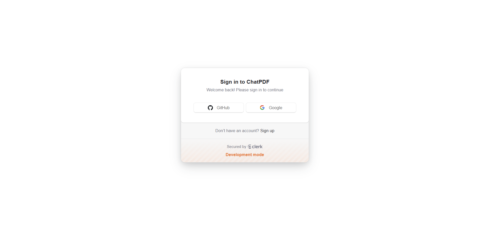
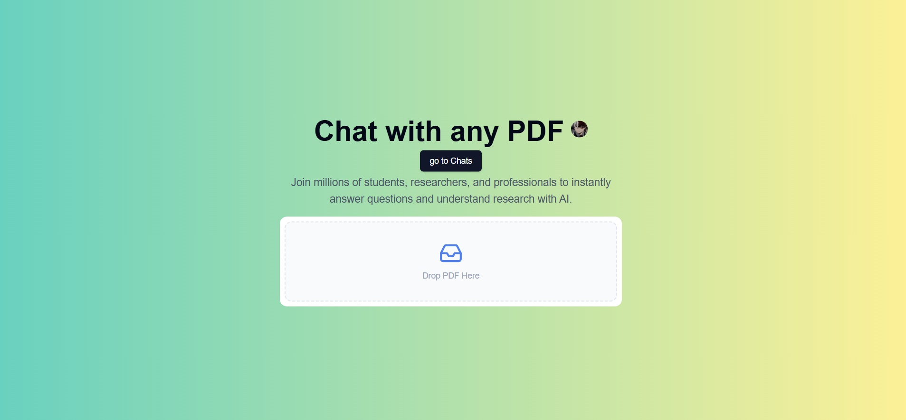
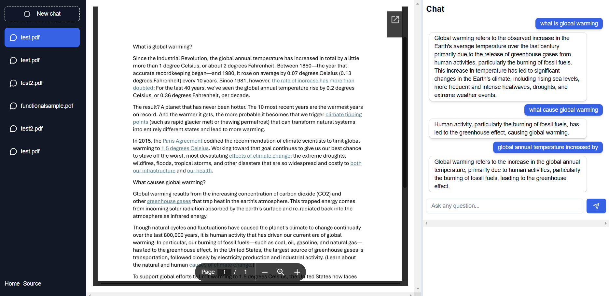

# Real-Time Chat Application with PDF Analysis

A comprehensive real-time chat application built using Next.js, Pinecone, Supabase, Neon DB, Python, and TypeScript. This application allows users to upload PDFs, chat with an AI assistant that uses the PDF content, and get answers to their queries.

## Tech Stack
 
- **Frontend**: 
  - React.js (using TypeScript)
  - TailwindCSS for styling
  - Next.js for server-side rendering and API routes
  - React Query for data fetching and state management
  - Lucide icons
  - shadcn/

- **Backend**:
  - **Neon DB**: Cloud-native database for storing user data, messages, and chat sessions
  - **Supabase**: Authenticates users and manages real-time data
  - **Pinecone**: Vector database to store and query embeddings for the uploaded PDF content
  - **Python**: generate_embeddings for PDF extraction and embeddings processing
  - Drizzle ORM
  - **Gemini API**
  - **Pinecone API**

## Features

- **Real-Time Chat**: Users can send and receive messages in real-time.
- **PDF Analysis**: Extracts content from uploaded PDFs and queries relevant information based on user input.
- **AI Integration**: Leverages Gemini API to provide answers to user queries.
- **Database Integration**: Stores chat messages and user data in Neon DB.

 
#### Screenshot:

### 2. **Upload PDF**
Users can upload PDFs to the system, and the AI can interact with the content of the uploaded PDFs.

#### Screenshot:

### 3. **Chat with PDF Content**
Once a PDF is uploaded, users can chat with an AI-powered assistant that extracts information from the PDF content.

#### Screenshot:

### Prerequisites

- Node.js
- TypeScript
- Supabase Account (for database and storage)
- Pinecone Account (for vector database)
- Gemini API Key (for AI-powered chat)

## Check .env.example for the required environment variables and ensure they are set up in your .env file.

